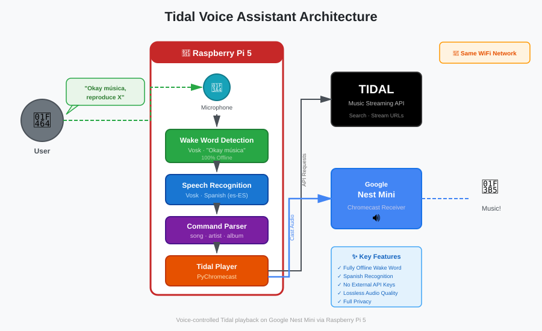

# Claude Code Context

## Project Overview

This is a **Tidal Voice Assistant** for Raspberry Pi 5 that enables voice-controlled music playback from Tidal on a Google Nest Mini (2nd generation). The project was created because Google Nest Mini doesn't support Tidal integration reliably.

## Project Conventions

### Response Style
- Be concise, minimize explanatory text. I am reaching easily Claude's rate-limits per sessions.
- Show code changes, not lengthy explanations
- Skip "here's what I did" preambles

## Problem Statement

Jorge has a Google Nest Mini (2nd gen) that he uses for:
- Weather queries
- Timers
- Music playback

**Issue**: Cannot link Tidal account to Nest Mini for voice-controlled music playback.

**Solution**: Use Raspberry Pi 5 as an intermediary that:
1. Listens for music-specific voice commands (in Spanish)
2. Searches and fetches music from Tidal
3. Casts audio to Nest Mini via Chromecast protocol
4. Keeps native "Ok Google" functionality for non-music tasks

## Technical Requirements

### Hardware
- Raspberry Pi 5 (already owned by user)
- Google Nest Mini 2nd generation
- USB microphone or microphone HAT

### Software Stack
- **Python 3.9+**
- **Vosk**: Offline speech recognition and wake word detection (Spanish model)
- **tidalapi**: Tidal API integration
- **pychromecast**: Google Cast protocol for streaming to Nest Mini
- **pyaudio**: Audio capture

### Language Requirements
- All speech recognition must use **Spanish from Spain** (es-ES)
- Wake phrases: "Hey Tidal" or "Oye Tidal" (fully offline detection)
- Command parsing must understand Spanish music commands

## Architecture



For a detailed visual representation of the system architecture, see [architecture.svg](architecture.svg).

**Component Flow:**
- User → Microphone → Wake Word Detection (Vosk) → Speech Recognition (Vosk)
- Speech Recognition → Command Parser → Tidal Player
- Tidal Player ↔ Tidal API (search, stream URLs)
- Tidal Player → Pychromecast → Google Nest Mini (audio playback)

## Key Components

### 1. Wake Word Detection (`wake_word.py`)
- Uses Vosk for wake word detection (fully offline)
- Default wake phrases: "Hey Tidal", "Oye Tidal"
- No external API dependencies
- Note: Picovoice was evaluated but not used to reduce external dependencies and failure points

### 2. Speech Recognition (`speech_recognition.py`)
- Vosk model: `vosk-model-small-es-0.42` (Spanish from Spain)
- Offline recognition (no cloud dependency)
- Captures audio for 5 seconds after wake word

### 3. Command Parser (`command_parser.py`)
- Parses Spanish music commands:
  - "reproduce [canción]" → play song
  - "pon música de [artista]" → play artist
  - "reproduce el álbum [nombre]" → play album
- Playback control commands:
  - "para" / "stop" → stop playback
  - "pausa" → pause playback
  - "continúa" / "sigue" → resume playback
- Uses regex patterns adapted for Spanish

### 4. Tidal Integration (`tidal_player.py`)
- OAuth device flow authentication
- Search API integration
- Stream URL fetching
- Session management with token refresh (auto-saves refreshed tokens)
- **Autoplay/Continuous playback**: Automatically queues similar tracks using Tidal's track radio feature
- **Token expiry notification**: When refresh token expires (~30 days), announces on Nest Mini in Spanish that manual re-auth is needed

### 5. Chromecast Handler (`tidal_player.py`)
- Device discovery on local network
- Media casting via pychromecast
- Handles stream URLs from Tidal

## Spanish Command Patterns

```python
# Examples of Spanish commands to support:
commands = {
    'play_song': [
        "reproduce bohemian rhapsody",
        "pon la canción de heroes del silencio",
        "reproduce todo de ti de rauw alejandro"
    ],
    'play_artist': [
        "pon música de queen",
        "reproduce canciones de metallica",
        "pon algo de rosalía"
    ],
    'play_album': [
        "reproduce el álbum a night at the opera",
        "pon el disco el madrileño",
        "reproduce el álbum de bad bunny"
    ],
    'playback_controls': [
        "para",           # stop
        "stop",           # stop
        "pausa",          # pause
        "continúa",       # resume
        "sigue"           # resume
    ]
}
```

## Configuration

### Environment Variables (`.env`)
```bash
LOG_LEVEL=INFO  # Optional: DEBUG, INFO, WARNING, ERROR, CRITICAL
```

**Note**: Tidal authentication uses OAuth device flow - no credentials needed in `.env`

### Config File (`config.py`)
```python
TIDAL_CONFIG = {
    'quality': 'LOSSLESS',  # LOSSLESS, HIGH, LOW
    'session_file': 'tidal_session.json'
}

# Autoplay Configuration
AUTOPLAY_ENABLED = True   # Enable continuous playback after a song ends
AUTOPLAY_TRACK_COUNT = 10 # Number of similar tracks to queue for autoplay

CHROMECAST_NAME = "Altavoz Google"  # User's Nest Mini name
```

## Usage Flow

### Music Playback Flow
1. **User says**: "Hey Tidal, reproduce Bohemian Rhapsody"
2. **Wake word detected**: Vosk detects "hey tidal" trigger phrase
3. **Speech captured**: 5 seconds of audio recorded
4. **Transcribed**: Vosk converts to text (Spanish)
5. **Parsed**: Command parser extracts "reproduce" + "Bohemian Rhapsody"
6. **Searched**: Tidal API finds matching track
7. **Streamed**: Pychromecast sends audio URL to Nest Mini
8. **Playback**: Music plays on Nest Mini
9. **Autoplay**: Similar tracks are automatically queued for continuous playback

**Autoplay Behavior:**
- **Single song**: Plays the requested track, then queues 10 similar tracks from Tidal's track radio
- **Artist**: Queues up to 20 top tracks from the artist
- **Album**: Queues all tracks from the album in order

Autoplay can be disabled by setting `AUTOPLAY_ENABLED = False` in `config.py`.

### Playback Control Flow
1. **User says**: "Hey Tidal, pausa"
2. **Wake word detected**: Vosk detects trigger phrase
3. **Speech captured**: Audio recorded
4. **Transcribed**: Text "pausa" recognized
5. **Parsed**: Command parser identifies 'pause' action
6. **Executed**: Pause command sent to Chromecast
7. **Result**: Music playback paused

For non-music commands, user continues using:
- "Ok Google, ¿qué tiempo hace?"
- "Ok Google, pon un temporizador"

## Development Priorities

### Phase 1: Core Functionality (Completed)
- [x] Wake word detection (Vosk-based, fully offline)
- [x] Spanish speech recognition
- [x] Basic command parsing
- [x] Tidal authentication
- [x] Chromecast streaming
- [x] Testing utilities
- [x] Comprehensive wake word testing and troubleshooting
- [x] Logging system with configurable levels
- [x] Retry mechanisms with exponential backoff
- [x] Basic playback control (stop, pause, resume)
- [x] **Autoplay/Continuous playback** (queues similar tracks automatically)
- [x] **Full album and artist playback** (queues all tracks, not just first)

### Phase 2: Enhanced Features
- [ ] Optimize wake word CPU usage
- [ ] Improved command parsing (more variations)
- [ ] Error handling and user feedback
- [ ] Volume control
- [ ] Skip track functionality

### Phase 3: Advanced Features
- [ ] Playlist support
- [ ] Multi-room audio
- [ ] Web interface
- [ ] Home Assistant integration
- [ ] Catalan language support (relevant for Menorca)

## Testing Strategy

### Unit Tests
- Command parser with Spanish variations
- Tidal API integration
- Chromecast discovery and connection

### Integration Tests
- End-to-end voice command flow
- Network connectivity
- Audio streaming quality

### Manual Tests
- Microphone audio quality
- Wake word sensitivity
- Speech recognition accuracy
- Latency measurements

## Known Issues & Limitations

1. **Wake Word CPU Usage**: Vosk-based wake word uses ~15-25% CPU (continuous transcription) - acceptable for dedicated Pi 5
2. **Wake Word Latency**: 200-500ms detection time (vs <50ms with cloud solutions like Picovoice)
3. **Network Dependency**: Requires stable WiFi for both Pi and Nest Mini
4. **Speech Recognition**: Works best in quiet environments
5. **Tidal API**: Rate limits may apply for heavy usage
6. **Language**: Currently only Spanish from Spain (could add Catalan)

## Security Considerations

- OAuth tokens stored in `tidal_session.json` (gitignored)
- No passwords stored - OAuth device flow only
- All wake word processing is local and offline (no cloud)
- No encryption on local audio capture (acceptable for home use)

## Performance Considerations

- **Wake word detection**: 200-500ms latency, ~15-25% CPU usage (continuous Vosk)
- **Speech recognition**: 1-2 seconds (offline, depends on audio quality)
- **Tidal search**: 500ms-1s (network dependent)
- **Chromecast streaming**: <1s buffering
- **Total response time**: 3-5 seconds from wake word to music playback

## Dependencies

### System Packages
```bash
portaudio19-dev     # Audio I/O (pyaudio installed via pip)
```

### Python Packages
```
vosk                # Speech recognition + wake word detection
pyaudio             # Audio capture
tidalapi            # Tidal API
pychromecast        # Chromecast protocol
python-dotenv       # Environment variables
gtts                # Text-to-speech (testing only)
```

## File Structure

```
tidal-voice-assistant/
├── main.py                      # Entry point
├── config.py                    # Configuration
├── tidal_auth.py               # Tidal authentication
├── wake_word.py                # Wake word detection
├── speech_recognition.py       # Spanish STT
├── command_parser.py           # Parse Spanish commands
├── tidal_player.py             # Tidal + Chromecast
├── test_chromecast.py          # Chromecast testing
├── test_tidal.py               # Tidal testing
├── test_wake_word.py           # Wake word testing and troubleshooting
├── requirements.txt            # Python deps
├── .env.example                # Environment template
├── tidal-assistant.service     # Systemd service
└── vosk-model-es/              # Spanish model (downloaded)
```

## User Experience Goals

1. **Seamless Integration**: Voice commands feel natural
2. **Low Latency**: 3-5 seconds from command to playback
3. **High Accuracy**: Spanish recognition >90% accurate
4. **Reliable**: Handles network issues gracefully
5. **Transparent**: User knows when using Pi vs Nest Mini

## Future Evolution Ideas

### Multi-Language Support
- Add Catalan (co-official language in Menorca)
- Language detection or explicit switching

### Home Automation Integration
- Integrate with Home Assistant
- Room-aware audio (multiple Nest Minis)
- Automation triggers (play music when arriving home)

### Advanced Music Features
- Create/manage playlists via voice
- ~~Radio mode (continuous playback)~~ ✅ Implemented via autoplay
- Music recommendations
- Lyrics display (if screen available)

### Technical Improvements
- Use better Spanish models (larger Vosk models)
- GPU acceleration for speech recognition
- Custom wake word training
- Web dashboard for configuration

## Resources & References

- **Vosk Models**: https://alphacephei.com/vosk/models
  - Spanish: `vosk-model-small-es-0.42` (244MB)
  - Larger model: `vosk-model-es-0.42` (1.4GB, better accuracy)
  - Used for both wake word detection and command recognition

- **Pychromecast**: https://github.com/home-assistant-libs/pychromecast
  - Google Cast protocol implementation
  - Device discovery and media control

- **Tidal API**: https://github.com/tamland/python-tidal
  - Unofficial Python client
  - OAuth device flow authentication
  - Search and streaming

## Contact & Context

- **User**: Jorge (Cloud Security Engineer)
- **Location**: Menorca, Balearic Islands, Spain
- **Context**: Personal home automation project
- **Goal**: Enable Tidal on Nest Mini via Raspberry Pi bridge

## Notes for Claude Code

When working on this project:

1. **Language**: All voice commands are in Spanish (Spain variant)
2. **Hardware**: Raspberry Pi 5 is available, microphone needed
3. **Testing**: User wants to test Chromecast casting first
4. **User Expertise**: Jorge is highly technical, comfortable with CLI and code
5. **Priorities**: Functionality over polish in first iteration
6. **Future**: Open to enhancements and additional features

## Quick Start Commands for Development

```bash
# Setup
python3 -m venv venv
source venv/bin/activate
pip install -r requirements.txt

# Download Spanish model
wget https://alphacephei.com/vosk/models/vosk-model-small-es-0.42.zip
unzip vosk-model-small-es-0.42.zip

# Test Chromecast
python test_chromecast.py --discover
python test_chromecast.py --test

# Authenticate Tidal (OAuth device flow - follow URL in output)
python tidal_auth.py

# Run application
python main.py
```

This context should help you understand the project's goals, architecture, and technical requirements for future development sessions.
